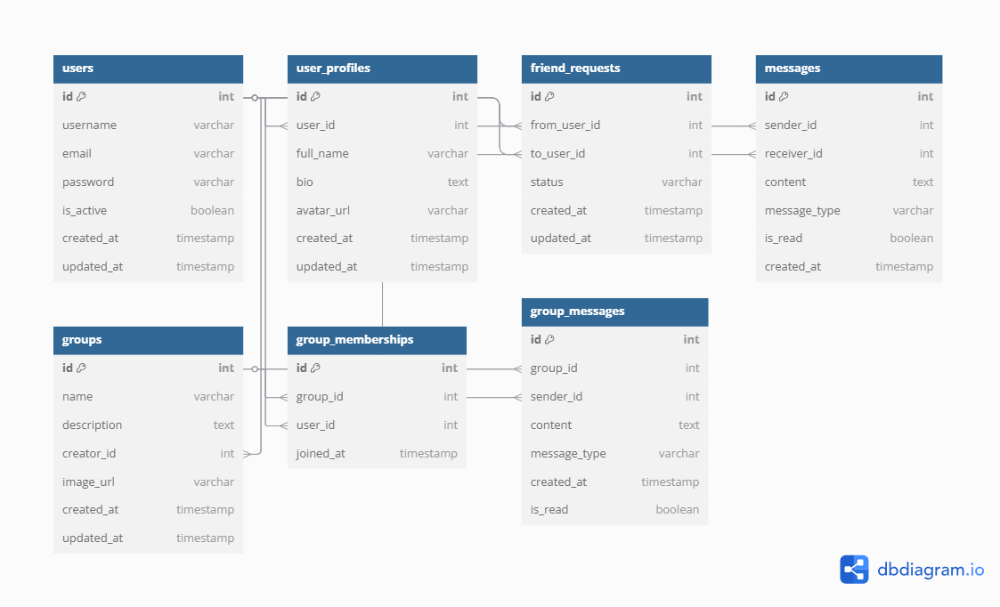

# 📬 Django Chat API

A real-time-ready chat API built with Django and DRF. Features user authentication, friend management, one-on-one messaging, group chats, Docker, CI/CD, and cloud deployment.

---

## Live API Docs
[Chat API Swagger UI](http://16.170.61.99/swagger/)

---

## 🔧 Tech Stack
- Django + Django REST Framework
- PostgreSQL
- JWT Auth (`djangorestframework-simplejwt`)
- Docker + docker-compose + Makefiles
- GitHub Actions (CI/CD)
- Railway (or EC2)

---

## 📦 Features
- User registration & login
- Profile management
- Send & accept friend requests
- One-on-one messaging
- Group chat creation & management
- Real-time-ready, WebSocket with Django Channels  
- Dockerized + CI/CD + deployed

---

## 🧪 Installation

```bash
git clone https://github.com/Dipec001/django-chat-api.git
cd django-chat-api
cp .env.example .env
docker-compose up --build
```
## 🧱 Project Structure

DJANGOCHATAPI/
├── chat/ # Django app
│ ├── models/
│ ├── views/
│ ├── serializers/
│ ├── urls/
│ ├── permissions.py
│ ├── signals.py
│ ├── init.py
│ ├── utils.py
│ ├── backends.py
│ ├── consumers.py
│ ├── routing.py
│ ├── apps.py
│ └── admin.py
├── djangochatapi/ # Django project settings
│ ├── init.py
│ ├── settings.py
│ ├── middlewares.py
│ ├── urls.py
│ └── wsgi.py
├── .github/
│ └── workflows/
│ └── checks.yml # GitHub Actions config
├── Dockerfile
├── docker-compose.yml
├── Makefile
├── LICENSE
├── requirements.txt
├── pytest.ini
├── .env
├── README.md
└── manage.py


---

## 🔌 API Endpoints

### 🧍‍♂️ User Auth
| Method | Endpoint         | Description          |
|--------|------------------|----------------------|
| POST   | /api/register/   | Register new user    |
| POST   | /api/login/      | Login and get JWT    |
| GET    | /api/profile/    | Get own profile      |
| PUT    | /api/profile/    | Update own profile   |

### 👥 Friend Management
| Method | Endpoint                    | Description               |
|--------|-----------------------------|---------------------------|
| POST   | /api/friends/request/       | Send friend request       |
| POST   | /api/friends/accept/        | Accept friend request     |
| POST   | /api/friends/decline/       | Decline friend request    |
| DELETE | /api/friends/remove/        | Unfriend someone          |
| GET    | /api/friends/list/          | List current friends      |
| GET    | /api/users/search/?q=term   | Search users by name or username |

### 💬 One-on-One Messaging
| Method | Endpoint                      | Description                |
|--------|-------------------------------|----------------------------|
| POST   | /api/messages/send/           | Send message to a user     |
| GET    | /api/messages/user/{id}/      | View 1-on-1 chat history   |
| GET    | /api/messages/inbox/          | View chat inbox            |

### 👥 Group Chat
| Method | Endpoint                          | Description                        |
|--------|-----------------------------------|------------------------------------|
| POST   | /api/groups/create/               | Create group chat                  |
| PUT    | /api/groups/{id}/update/          | Update group chat details          |
| POST   | /api/groups/{id}/add/             | Add member to group chat           |
| POST   | /api/groups/{id}/remove/          | Remove member from group chat      |
| POST   | /api/groups/{id}/send/            | Send group message                 |
| GET    | /api/groups/{id}/messages/        | View group chat history            |

### 🛎️ Notifications
| Method | Endpoint            | Description                         |
|--------|---------------------|-------------------------------------|
| GET    | /api/notifications/ | List message/friend request alerts  |

### 🛠️ System
| Method | Endpoint     | Description          |
|--------|--------------|----------------------|
| GET    | /health/     | Health check route   |
| GET    | /metrics/    | App usage stats      |

---

## 🧩 Architecture Diagram


## 🗃️ ER Diagram



## 🧠 Future Improvements

- Mobile-ready notifications  
- Group admin controls  
- Delivery/read receipts  
- Push notifications via Firebase

---

## 👨‍💻 Author

**Divine Chukwu**  
[LinkedIn](https://www.linkedin.com/in/divine-chukwu-63bb04145/) • [GitHub](https://github.com/Dipec001)

---

## 🪄 License

MIT License
